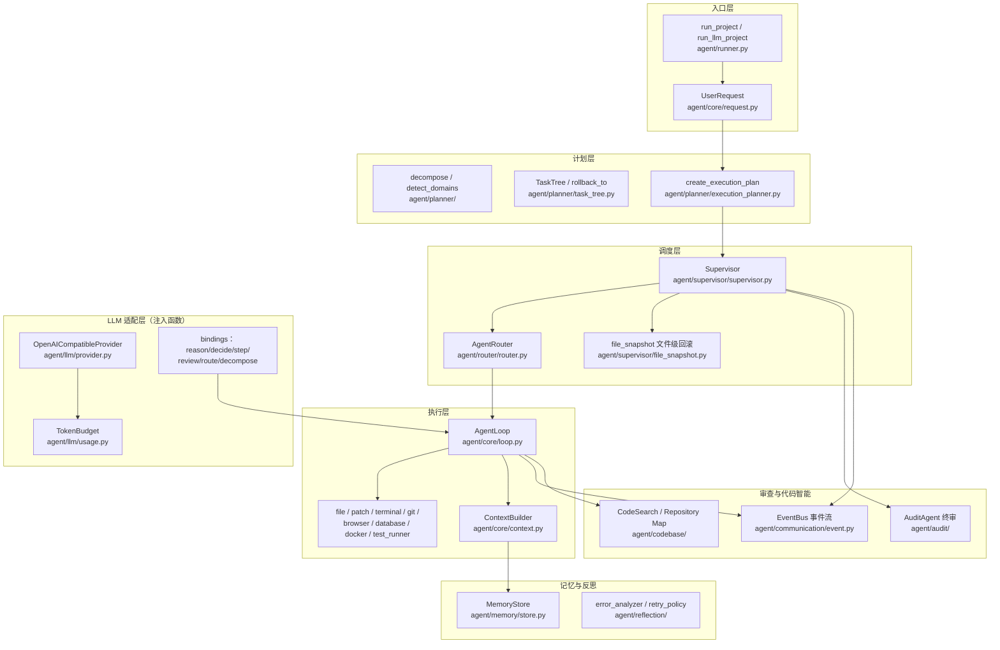
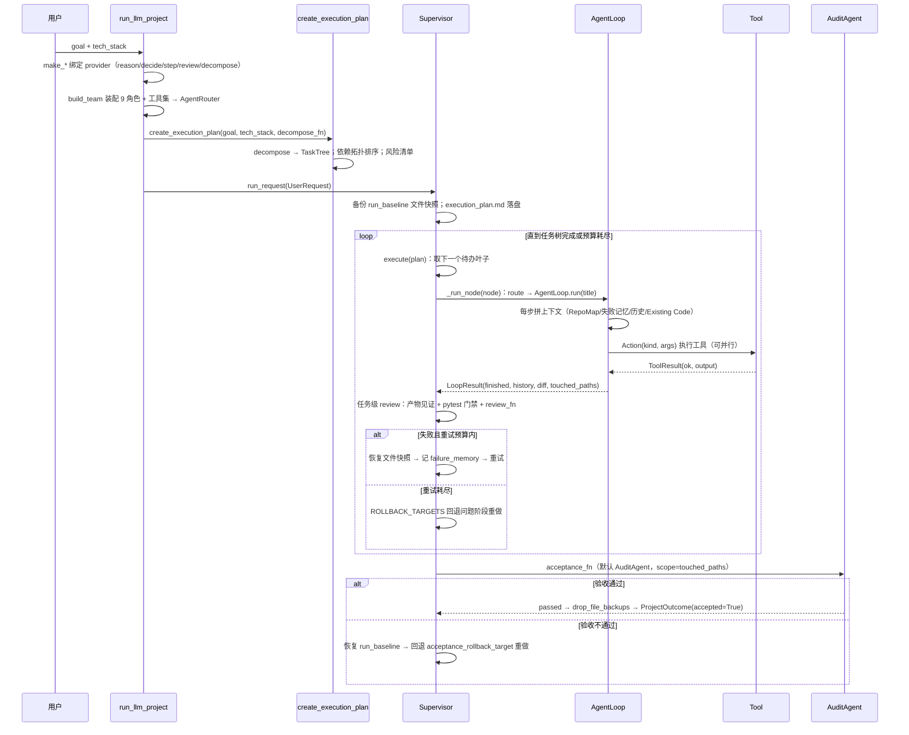

# 软件开发 Agent 技术文档（UpAgent）

> 面向未参与过本 Agent 开发的普通程序员（熟悉 Agent、任务树、回退、token 预算等
> 软件工程术语）。读完本文可以看懂 `agent/` 包的整体设计、定位任何一段核心逻辑，
> 并知道从哪里扩展。
>
> 范围：仓库根下的 `agent/` 包（自研运行时，纯标准库、可离线测试）。
> 仓库里的 `src/tau_*` 是 Tau 基座（CLI / TUI / 会话管理），`desktop/` 是给本
> Agent 的三栏桌面前端（文件树 / 编辑器 / 任务对话），二者不是本文重点。
> 演进历史见 `dev-notes/software-development-agent-phase.md`（构建日志），
> 设计草案见 `dev-notes/new.md`。

## 1. 一句话定位

用户只输入两样东西——**最终目标 + 可能的技术栈**，Agent 自动完成
**计划 → 执行 → 审查** 闭环：

```text
UserRequest(goal, tech_stack)
        │
        ▼
ExecutionPlan（任务树 + 依赖序 + 风险）        ← planner/
        │
        ▼
Supervisor 逐任务调度（重试 / 回退 / 预算）     ← supervisor/
        │
        ▼
AgentLoop 思考→决策→执行→记录（单任务）         ← core/
        │
        ▼
任务级 review 门禁 + 终审 acceptance 验收       ← supervisor/ + audit/
        │
        ▼
ProjectOutcome（finished / accepted / 报告）
```

失败处理是自动化的：重试 → 换方法 → 回退到问题阶段重做 → 写入
`failure_memory`（同错不二犯）→ 预算耗尽停止。产物文件在写入前自动备份，
验收失败自动恢复（文件级回滚）。

## 2. 总体架构

`agent/` 内部按职责分层，LLM 只出现在最外层的注入函数里（生产接 DeepSeek，
测试用桩函数），核心引擎不依赖任何模型：



设计红线（后文第 6 节逐条展开）：

- **LLM 全部注入**：`reason_fn` / `decide_fn` / `step_fn` / `review_fn` /
  `decompose_fn` / `acceptance_fn` / `repo_map_provider` / `code_snapshot_provider`，
  核心包零第三方依赖（仅 `httpx` 在 provider 层），桩函数即可全量离线测试。
- **每步 one-shot 上下文**：每步重新拼接完整上下文，没有增量压缩
  （70%/90% 自动压缩方案已回退，见构建日志）。
- **确定性门禁**：任务标题声明的产物文件必须真实存在、测试必须真实跑过
  pytest，防止 LLM「谎报完成」。
- **文件级回滚**：写文件前磁盘备份，失败恢复；只恢复不删除新增文件。

## 3. 一次运行的完整数据流

以 `scripts/llm_demo.py`（真实 LLM）或 `agent/README.md` 的最小示例（桩函数）
为参考，跟踪一次 `run_llm_project(goal, tech_stack, ...)`：



### 3.1 计划：从两行输入到任务树

1. `UserRequest`（`agent/core/request.py`）只做结构化与校验：`goal` 必填、
   长度上限；`render()` 输出给 LLM 的摘要。
2. `create_execution_plan`（`agent/planner/execution_planner.py`）：
   - `decompose_fn(task, tech_stack)` 拆出 `TaskTree`。规则版
     `decompose`（`agent/planner/decomposition.py`）固定八阶段骨架
     （Requirement / Architecture / Implementation / Testing / Security / Deploy），
     Implementation 下的子域由**任务关键词 + 技术栈**取并集得出
     （`stack_map.detect_domains`：React→frontend、FastAPI→backend、
     PostgreSQL→database……）；LLM 版拆解由 `make_decompose_fn` 提供，
     要求任务 ≤4 个且标题必须带产物文件路径（供确定性见证用）。
   - `plan_dependencies` + `execution_order` 对实现子域做依赖拓扑排序，
     并**重排 Implementation 子节点**，使 `TaskTree.next_task()` 按依赖序取叶子。
   - `assess_risks` 生成风险清单（`assess_fn` 可注入 LLM 版）。
3. `output_dir` 配置后，计划渲染为 `execution_plan.md` 落盘，发布
   `PLAN_CREATED` 事件。

### 3.2 调度：Supervisor 的失败处理全景

`Supervisor.run_request`（`agent/supervisor/supervisor.py`）是编排核心，
结构为「外层 while：执行 + 终审；内层 execute：逐叶子 + 回退」：

- `execute(plan)` 每次取 `plan.tree.next_task()`（深度优先第一个未完成叶子），
  交给 `_run_node`；节点彻底失败后按 `ROLLBACK_TARGETS` 回退
  （testing→implementation、security→architecture、deploy→implementation、
  implementation→architecture……），回退即把问题阶段及其后的节点重置为
  PENDING 重做。回退预算 `max_rollbacks`（默认 2）耗尽 → 写
  `failure_memory` 并停止（`finished=False`）。
- `_run_node(node)` 对单个任务：
  1. `router.route(node)` 按 `task_type` 选角色 Agent；
  2. **尝试前文件快照**（`file_snapshot.write_snapshot`，需配置
     `file_backups` + `output_dir`）；
  3. `AgentLoop.run(node.title)`；
  4. 任务级 review 门禁（见 3.3）；
  5. 失败 → 恢复文件快照 → `_record_attempt_failure`（错误诊断 +
     `RetryPolicy` 判定 retry/change_method/escalate → 教训写入
     `failure_memory`）→ 重试。重试次数由 `max_retries` 与 **token 预算**
     共同决定（用量 <60% 全额、60–80% 最多 1 次、≥80% 不再重试）。
- 终审（任务树完成且有 `acceptance_fn`）：`_invoke_acceptance` 注入
  `scope=tuple(touched_paths)`（本次运行实际写入的文件）；不通过 →
  **恢复 run_baseline 文件基线** → 回退 `acceptance_rollback_target`
  （默认 implementation）重做；通过 → `drop_file_backups()` 清理备份并返回
  `accepted=True`。验收失败时保留备份供人工恢复。

### 3.3 单任务循环：AgentLoop

`AgentLoop.run(task)`（`agent/core/loop.py`）是真正的「agent 大脑」，
每步固定五拍：

1. **拼上下文**：`ContextBuilder.build`（`agent/core/context.py`）组装
   User Task / Project State / Repository Map / Past Decisions /
   Known Failures / Knowledge / Recent Steps（最近 10 步，含失败原因）/
   Current Task / Existing Code，并追加步数压力提示
   （`Step N/10 ... avoid repeating successful steps`）。
2. **思考**：快路径 `step_fn`（LLM 一步式，reason+decide 合并一次调用，
   单步约 2s）；未配置时走慢路径 `agent.reason()` + `decide_fn` 两次调用。
3. **决策**：产出 `Action(kind, args, note)`；`kind="finish"` 即任务完成。
   `Action.parallel` 可携带多个无依赖子动作（并发执行）。
4. **执行**：`_execute` → `_run_one`（未知工具名转 failure，不炸循环）；
   写动作（file/patch）执行前捕获文件快照，执行后 `difflib` 生成 unified
   diff（单文件 60 行、总量 4000 字符封顶）→ 汇总进 `LoopResult.diff`，
   供 review 聚焦「本任务实际改了什么」。
5. **记录**：结果与失败原因写回 history（下一轮上下文自带纠错信息），
   成功动作的路径参数收集进 `touched_paths`（终审审计范围）；
   内存历史落 `MemoryStore`，并通过 `step_observer` 推给前端。

收敛兜底（两层，防 LLM 原地打转）：
- `max_steps=10`：单任务步数上限；
- **连续两次相同成功动作 → 强制 finish**（`_action_key` 动作指纹：
  kind + 参数集合），防止「成功探测后仍反复重跑」。

### 3.4 审查：两层门禁

- **任务级**（`Supervisor._review`）：
  1. 确定性产物见证 `_mentioned_files_exist`：任务标题里声明的文件路径
     （如 `sorting.py`、`tests/test_sorting.py`）至少一个真实存在，
     否则 REJECT——专门拦截「没写文件却报完成」；
  2. 确定性测试门禁 `_tests_pass`：testing 任务在产物目录真实运行
     `pytest`，全绿才算数；
  3. 注入的 `review_fn`（LLM 版 `make_review_fn` 输出 `{"passed": bool}`，
     调用失败时保守放行；审查摘要附 Code diff）。
- **终审级**：`acceptance_fn`，默认 `default_acceptance` 用
  `AuditAgent` 扫描 `output_dir`（`scope` 命中本次写入文件时只审这些文件），
  产出 `final_report.md`；Critical/High 发现或需求未 100% 完成 → 不交付。

### 3.5 记忆与反思

- `MemoryStore`（`agent/memory/store.py`）：`decision_log.md` /
  `failure_memory.md`（只追加 Markdown，运行时副本从模板复制、已 gitignore）
  与机器可读的 `history.jsonl`；注入上下文时各取最近 5 条，控制体积。
- 失败闭环（`agent/reflection/`）：`error_analyzer.analyze_output` 从测试/
  运行输出提取结构化诊断（错误类型 / 涉及文件 / 失败用例）→
  `RetryPolicy.next_action` 按错误签名决策（同类错误第 2 次换方法、第 3 次
  上报、总量超预算停止）→ 教训写入 `failure_memory`，下一轮上下文自动注入
  「Known Failures」完成避坑闭环。`fixer.py` / `reflector.py` 可把诊断转成
  聚焦的修复任务文本。

## 4. 各模块职责速查

| 模块 | 文件 | 职责 |
| --- | --- | --- |
| 输入 | `agent/core/request.py` | `UserRequest` 目标+技术栈+约束，校验与渲染 |
| 状态 | `agent/core/state.py` | `ProjectState` 八阶段生命周期、错误列表、JSON 持久化 |
| Agent | `agent/core/agent.py` | `Agent`=名字+角色 Prompt+工具集；`Thought` 思考结果 |
| 循环 | `agent/core/loop.py` | `AgentLoop` 五拍循环、并行、diff、touched_paths、收敛兜底 |
| 上下文 | `agent/core/context.py` | `ContextBuilder` 九段式上下文拼接 |
| 计划 | `agent/planner/` | 拆解、技术栈检测、依赖拓扑、风险、任务树回退 |
| 决策 | `agent/planner/planner.py` | 规则版 `decide`：解析 `ACTION:` / `ARG k=v` 行 |
| 调度 | `agent/supervisor/supervisor.py` | 重试/回退/预算/审查门禁/终审闭环 |
| 回滚 | `agent/supervisor/file_snapshot.py` | 文件级备份/恢复（写前备份、失败恢复） |
| 路由 | `agent/router/router.py` | `task_type` → Agent 注册表，LLM 路由回退 |
| 工具 | `agent/tools/` | 8 类工具；`base.py` 定义 `Tool.run -> ToolResult` 契约 |
| 记忆 | `agent/memory/` | 决策日志、失败记忆、运行历史；三层记忆 `tiers.py` |
| 反思 | `agent/reflection/` | 错误诊断、重试策略、修复任务生成 |
| LLM | `agent/llm/` | provider（httpx）+ bindings（注入函数）+ 配置 + token 预算 |
| 代码智能 | `agent/codebase/` | Repository Map、AST/正则分析、关键词/向量检索、快照提供器 |
| 终审 | `agent/audit/` | 五个 checker + 编排器 + 三维评分 → `final_report.md` |
| 事件 | `agent/communication/event.py` | `EventBus` 发布/订阅 + 全量事件日志 |
| 团队 | `agent/agents/team.py` | `build_team` 9 角色装配注册；`developer.py` 开发循环 |
| 入口 | `agent/runner.py` | `run_project` / `run_llm_project` / `default_acceptance` |

## 5. LLM 接入与容错

- `OpenAICompatibleProvider`（`agent/llm/provider.py`）：OpenAI 兼容
  `/chat/completions`，默认 `https://api.deepseek.com` + `deepseek-v4-flash`；
  密钥只从 `DEEPSEEK_API_KEY` 环境变量或 `.env` 读取（不入库）；每次响应
  记录 `last_finish_reason`（截断识别）并累计 token 到 `TokenBudget`。
- `bindings`（`agent/llm/bindings.py`）把所有注入点适配到 provider：
  `make_reason_fn` / `make_decide_fn` / `make_step_fn` / `make_review_fn` /
  `make_route_fn` / `make_decompose_fn`。提示词常量集中在文件顶部
  （`_DECIDE_SYSTEM` 等），包含 Windows 命令约束与收敛规则。
- 一步式 `step_fn` 的动作 JSON 解析降级链（模型抖动不中断流程）：
  1. `_extract_action_json` 常规提取（action/json 围栏、DSML 包裹、裸 JSON，
     平衡括号扫描）；
  2. 结构截断 → `_repair_truncated_json` 本地补齐闭合大括号；
  3. `finish_reason=length` → `_continue_truncated_json` 请求模型从截断点
     续写后拼接重试；
  4. `decide_fallback`（两段式 LLM 决策）；
  5. 规则 `Planner().decide` 兜底。
- 审查/路由/拆解的 LLM 调用失败均回退到规则行为（保守放行 / 空路由 /
  规则拆解），保证离线也能跑通。

## 6. 关键设计决策与不变量

改代码前先确认不破坏以下不变量：

1. **注入函数边界**：`agent/` 核心模块不得 import 具体模型 SDK；LLM 能力
   一律通过构造参数传入。新增能力时给注入点一个规则版默认实现。
2. **每步 one-shot**：上下文每步从头拼接，不在 AgentLoop 内维护跨步的
   增量压缩状态（曾实现 70%/90% 自动压缩，后按用户要求回退）。
3. **确定性验收优先**：凡能用规则验证的（文件存在性、pytest 退出码）
   不用 LLM 判断；LLM 审查失败保守放行，确定性门禁失败不放行。
4. **收敛预算层层设防**：步数（max_steps=10）→ 重试（max_retries=2，
   与 token 用量挂钩）→ 回退（max_rollbacks=2）→ 停止并记 failure_memory。
   任何一层都不允许「原地无限重试」。
5. **文件安全**：工具写文件限定 workspace（路径解析拒绝目录穿越）；
   Supervisor 写前备份、失败恢复（只恢复不删除新增）；`file_backups`
   需 `output_dir` 配合，默认关闭。
6. **Windows 优先**：提示词要求 cmd 兼容命令（dir/type/findstr/python），
   终端层另有命令翻译兜底；CRLF + UTF-8（无 BOM）行尾约定。
7. **事件即契约**：`EventBus` 发布所有阶段事件，前端（SSE）与测试都
   通过事件/`step_observer` 观察进度，不直接读内部状态。

## 7. 扩展指南

| 想做什么 | 改哪里 |
| --- | --- |
| 换模型/服务商 | 传自定义 `LLMProvider`（实现 `complete` / `complete_json`） |
| 换任务拆解 | `run_llm_project` 传 `decompose_fn`（或关闭 `use_llm_decompose`） |
| 换任务级审查 | 传 `review_fn`；换终审传 `acceptance_fn`（默认 AuditAgent） |
| 加新工具 | 继承 `agent/tools/base.py` 的 `Tool`，注册进 `build_team` 的工具包 |
| 加新角色 | `agent/roles/*.md` 新增角色文件 + `agent/agents/team.py` 的 `_TEAM` |
| 向量检索 | 给 `make_snapshot_provider` / `CodeSearch` 注入 `embed_fn` |
| 自定义前端 | 订阅 `EventBus` 或 `step_observer`（桌面端即如此接入 SSE） |
| 换执行策略 | 调 `max_steps` / `max_retries` / `max_rollbacks` / `TokenBudget` |

## 8. 运行与测试

```bash
# 全量离线回归（不依赖网络；Windows 下建议指定工作区内 basetemp）
.\.venv\Scripts\pytest.exe -q -p no:cacheprovider --basetemp=.pytest-tmp

# 真实 LLM 冒烟（需 DEEPSEEK_API_KEY，.env 或环境变量）
.\.venv\Scripts\python.exe scripts/llm_demo.py --goal "实现冒泡/快速/归并排序" --out .demo-out
```

最小代码示例与目录索引见 `agent/README.md`；桌面三栏前端见 `desktop/`。

## 9. 与构建日志的对应

本文是「当前状态」的静态视图；`dev-notes/software-development-agent-phase.md`
按时间记录了每轮增量的动机、实现与实测数据（排序场景 17 分钟 → 77 秒、
上下文压缩方案的回退、JSON 截断三层修复、Code Intelligence、文件级回滚等）。
排查历史决策或追溯某项行为为何如此设计时，先查该日志。